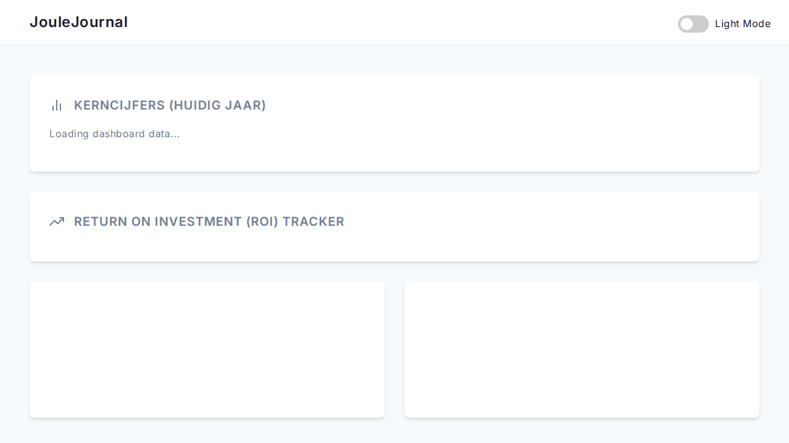

# JouleJournal

JouleJournal is a web application for monitoring, analyzing, and reporting energy consumption. It is designed to help you track your energy usage, analyze the performance of your energy investments (like solar panels and batteries), and make informed decisions about your energy consumption.

## Features

*   **Energy Monitoring:** Track your energy consumption and production over time.
*   **Investment Analysis:** Analyze the return on investment (ROI) for your energy-related investments.
*   **API-first design:** A comprehensive API allows for integration with other systems and services.
*   **Web-based UI:** A simple web interface for viewing your data and managing your settings.

## Screenshots



## Getting Started

You can run JouleJournal using Docker (recommended) or by setting up a local Python environment with Poetry.

### Prerequisites

*   Docker and Docker Compose (for Docker setup)
*   Python 3.12 and Poetry (for local setup)

### Docker Setup

1.  **Create a `.env` file:**
    Create a `.env` file in the root of the project and add the following environment variables. Replace the placeholder values with your desired settings.

    ```bash
    PORT=5201
    ADMIN_USER=admin
    ADMIN_PASSWORD=your_admin_password
    POSTGRES_USER=joulejournal
    POSTGRES_PASSWORD=your_postgres_password
    POSTGRES_DB=joulejournal
    LOG_LEVEL=INFO
    ```

2.  **Run with Docker Compose:**
    ```bash
    docker-compose up -d
    ```
    The application will be available at `http://localhost:5201`.

### Local Setup

1.  **Install dependencies:**
    ```bash
    poetry install
    ```

2.  **Set up PostgreSQL (Optional, SQLite is default):**
    The application will use a local SQLite database by default. If you want to use PostgreSQL, you can run it with Docker:
    ```bash
    docker run --name joulejournal-db -e POSTGRES_USER=joulejournal -e POSTGRES_PASSWORD=your_postgres_password -e POSTGRES_DB=joulejournal -p 5432:5432 -d postgres:15
    ```
    You will also need to set the `DATABASE_URL` environment variable.

3.  **Run database migrations:**
    ```bash
    poetry run alembic upgrade head
    ```
    *Note: Some migrations may not be compatible with SQLite.*

4.  **Run the application:**
    ```bash
    poetry run uvicorn app.main:app --host 0.0.0.0 --port 5201
    ```
    The application will be available at `http://localhost:5201`.

## API Endpoints

JouleJournal provides the following API endpoints:

*   **Authentication:** `/api/auth` - User authentication.
*   **Batteries:** `/api/batteries` - Manage battery information.
*   **Cars:** `/api/cars` - Manage car information.
*   **Investments:** `/api/investments` - Manage investment data.
*   **Journal:** `/api/metrics` - Log and retrieve energy metrics.
*   **ROI:** `/api/roi` - Calculate and retrieve ROI data.
*   **Tariffs:** `/api/tariffs` - Manage energy tariff information.
